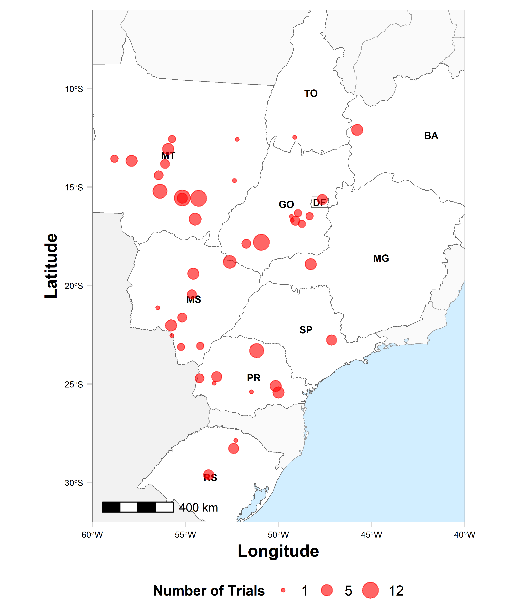

## About

This website provides easy access to commented R scripts that allows reproducing the analysis of the data from our publication.

The present study updates critical information on the management of soybean rust with fungicides in Brazil during the past six growing seasons (2014/15 - 2019/20) across a range of environments in 10 Brazilian states (BA, DF, TO, GO, MG, MS, MT, SP, PR, and RS) for controlling Soybean Rust (SBR) (caused by *Phakopsora pachyrhizi*). We used a network meta-analytic approach to compare the performance of eight fungicides, including dual and triple premixes, and to check whether there was significant decline in fungicide efficacy and yield response over time. Additionally, We checked whether at least portion of the heterogeneity in treatment effects could be explained by geographical region and baseline levels of disease. We further used the mean and uncertainty of the meta-analytic estimates in risk analysis for aiding decision making with regards the profitability of the registered fungicides under a range of scenarios.

 
Code: [MIT](https://opensource.org/licenses/MIT) year: 2018, copyright holder: Emerson Del Ponte

